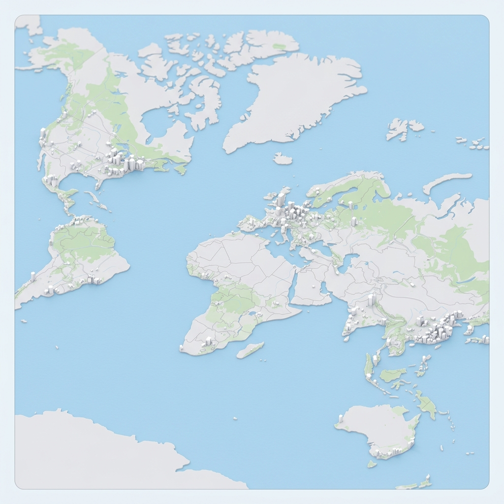

# 🏅 ShowUp

**Show up. Play. Connect.**

ShowUp is an elite, web-first sports social platform designed for the Indian urban market. It bridges the gap between digital coordination and real-world play, replacing fragmented WhatsApp groups with a unified, map-centric community.



## 🚀 The Vision
In a world of digital silos, ShowUp brings people back to the local playground. Whether it's Sunday football, a quick badminton match, or an impromptu basketball session, ShowUp makes finding a game as easy as dropping a pin.

## ✨ Key Features

- **📍 Live Map Discovery:** A real-time, interactive map to find games happening in your sector instantly.
- **🛡️ Privacy First:** Coordinate matches, chat with players, and join groups without ever sharing your phone number.
- **⭐ Pro Reputation:** Build your sports identity with verified ratings for skill, sportsmanship, and reliability.
- **💨 Ghost Groups:** Temporary game groups that auto-delete after the match. No more awkward, leftover WhatsApp chats.
- **🇮🇳 Built for India:** Optimized for local urban sectors, park cultures, and the energetic Indian sports vibe.

## 🛠️ Tech Stack

- **Framework:** [Next.js 14](https://nextjs.org/) (App Router)
- **Styling:** [Tailwind CSS v4](https://tailwindcss.com/) (High-performance, modern theme)
- **Animations:** [Framer Motion](https://www.framer.com/motion/) (Premium micro-interactions & 3D tilts)
- **Mapping:** [Leaflet](https://leafletjs.com/) (Custom-filtered interactive maps)
- **Icons:** [Lucide React](https://lucide.dev/)
- **Typeface:** [Inter](https://rsms.me/inter/) (Sporty & Professional)

## 🏗️ Project Structure

```bash
├── app/              # Next.js App Router (Marketing & App routes)
├── components/       # Reusable UI components (Landing, Map, Shared)
├── public/           # Static assets (Snap Map style visuals, Icons)
├── lib/              # Utility functions and shared logic
└── styles/           # Global styles and Tailwind configuration
```

## 🚦 Getting Started

### Prerequisites
- Node.js 18+ 
- npm / pnpm / yarn

### Installation

1. **Clone the repository:**
   ```bash
   git clone https://github.com/naitik2004/ShowUp.git
   cd ShowUp
   ```

2. **Install dependencies:**
   ```bash
   npm install
   ```

3. **Run the development server:**
   ```bash
   npm run dev
   ```

4. **Open the app:**
   Navigate to [http://localhost:3000](http://localhost:3000) to see the elite landing page.

## 📈 Roadmap
- [x] Elite Landing Page & UI Foundation
- [ ] User Authentication (Supabase + Phone OTP)
- [ ] Interactive Map App Interface
- [ ] User Profile & Reputation System
- [ ] Venue Partner Integration

---

Built with ⚡ by the ShowUp Team.
